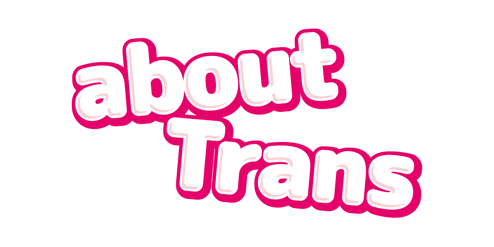

<p align="center">
  
</p>

aboutTrans 是一个由社群共建的跨性别与多元性别知识平台，项目名称来源于“关于跨性别”的英译。我们致力于为公众提供以跨性别为主，并涵盖多元性别议题的相关知识，以帮助更多人了解和支持这一群体！

项目站点请访问 [aboutrans.info](https://aboutrans.info)。

## 参与共建

我们欢迎你通过 GitHub 提交 Issue 或 Pull Request，也欢迎你 [通过邮件联系我们](mailto:contact@aboutrans.info) 或 [加入我们的项目交流群](https://qm.qq.com/q/ExEqmGZ16g)。

## 项目许可

本项目代码采用 [MIT](https://github.com/AB-aboutTrans/aboutTrans/blob/main/LICENSE) 许可；除特别说明外，项目内容采用 [CC BY 4.0](https://github.com/AB-aboutTrans/aboutTrans/blob/main/LICENSE-CC-BY-4.0) 许可。转载或改编文档内容时，请务必按照相应许可的要求保留署名，并注明内容来源。

## 本地预览

> 如果你希望在本地查看修改后的文档，需要先安装 Git、Node.js 与 npm。

```bash
# 克隆项目仓库
git clone https://github.com/AB-aboutTrans/aboutTrans.git
cd aboutTrans

# 安装项目依赖
npm install

# 启动本地预览
npm run docs:dev
```
