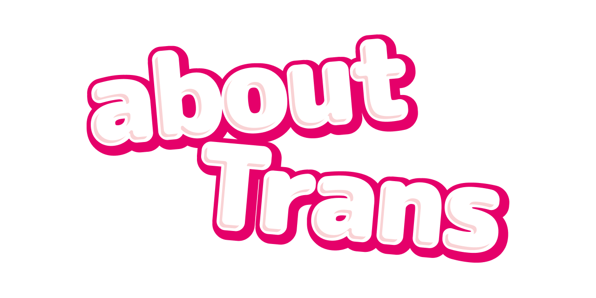

  

aboutTrans 是由社群共建的跨性别与多元性别知识平台。我们致力于向公众介绍以跨性别为主、涵盖多元性别议题的知识，帮助更多人了解并支持跨性别与多元性别群体。

项目站点请访问 [aboutrans.info](https://aboutrans.info)。

## 参与共建

欢迎 [通过邮件联系我们](mailto:contact@aboutrans.info) 或 [加入我们的项目交流群](https://qm.qq.com/q/ExEqmGZ16g)。你也可以在 GitHub 提交 Issue 或 Pull Request，参与共建。

## 项目许可

本项目代码采用 [MIT](https://github.com/AB-aboutTrans/aboutTrans/blob/main/LICENSE) 许可；除特别说明外，项目内容采用 [CC BY 4.0](https://github.com/AB-aboutTrans/aboutTrans/blob/main/LICENSE-CC-BY-4.0) 许可。转载或改编文档内容时，请务必按照相应许可的要求保留署名，并注明内容来源。
